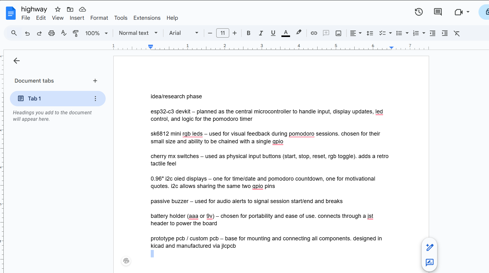
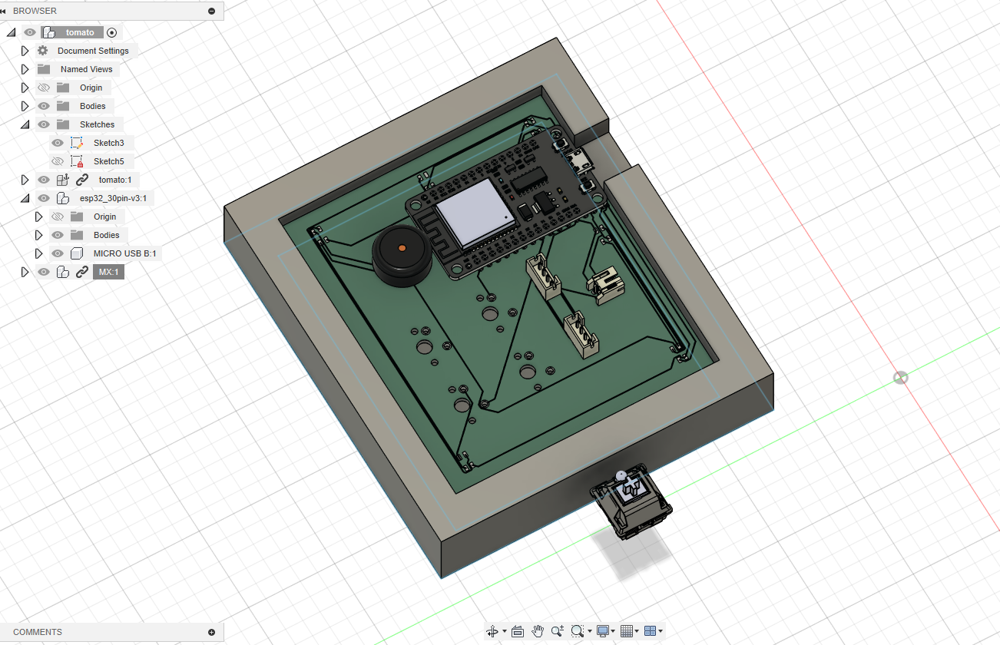
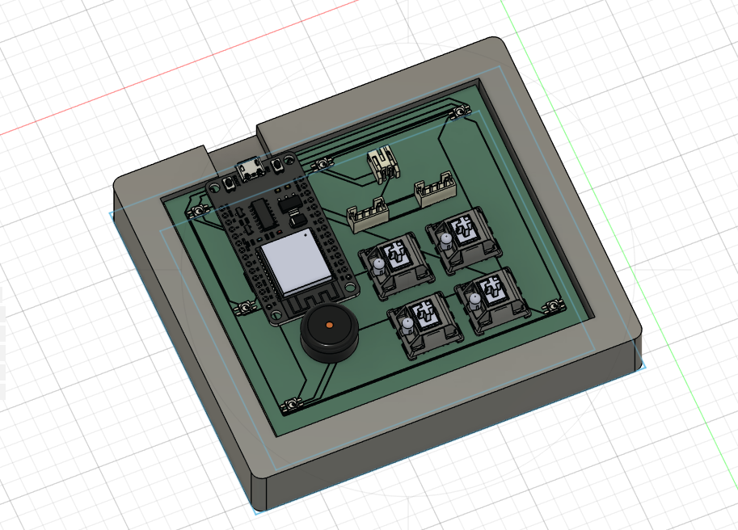
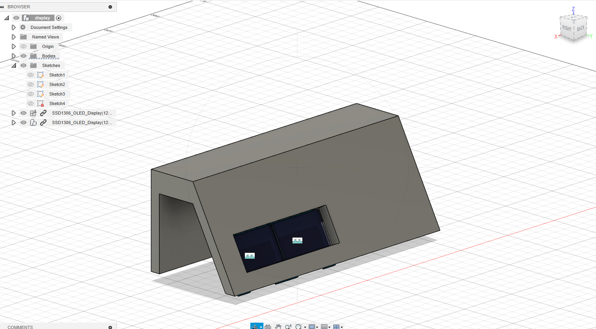
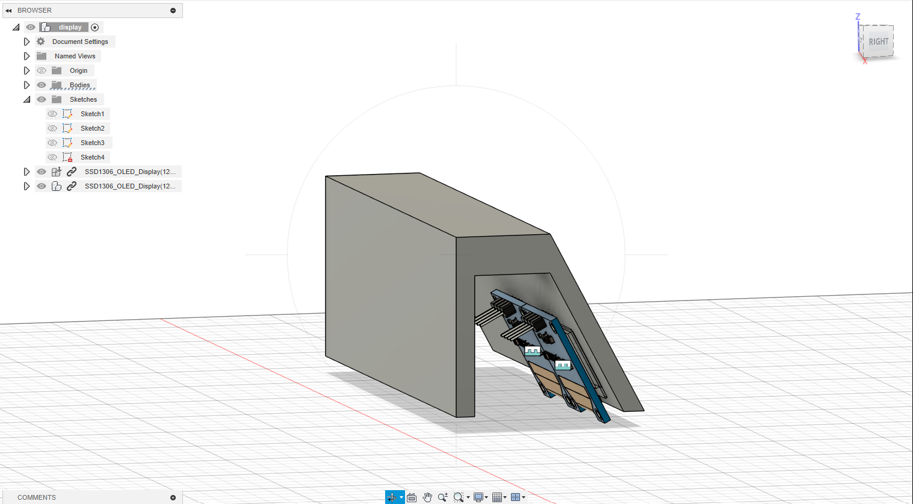
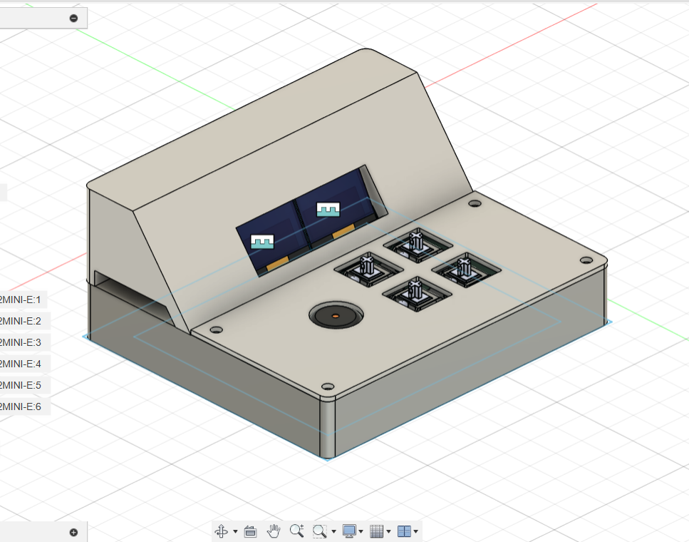

# JOURNAL.md

**Total time spent on the project: 9 hours**

---

**7/24 — Day 1: Idea Phase (15m)**  
Brainstormed the concept of a Pomodoro timer that mixes retro arcade styling with modern features like RGB LEDs, OLED displays, and mechanical switches. Decided it should display time, date, and motivational quotes and be powered by a common battery like AAA or 9V. Envisioned an arcade-style case shaped like an elongated rectangular LED panel or mini toy cash register.

---

**7/25 — Day 2: Research Phase (45m)**  
Looked into available components like Cherry MX switches, SK6812 mini LEDs, SSD1306 OLEDs, and ESP32-C3 DevKit. Verified compatibility and power requirements. Chose to keep it all common-hobbyist friendly. Started reviewing JST connector types and checked battery compatibility.

---

**7/26 — Day 3: Schematic Phase (2hrs)**  
Spent about 2 hours drawing the schematic in KiCad. Wired up the ESP32 to the LEDs, switches, dual OLEDs, and buzzer. Worked through pin mapping and planned power nets. Discussed button matrixing and GPIO assignment. Got the schematic fully functional.

---

**7/27 — Day 4: CAD Layout Begins (2hrs)**  
Started assigning footprints to all components. Adjusted orientation, looked up JST PH 2.0mm connector dimensions, and verified all parts were correctly represented. Previewed in 3D view in KiCad.

---

**7/28 — Day 5: CAD Finalization & Repo Prep (2hrs)**  
Wrapped up PCB layout and made final tweaks. Verified spacing and connector placement. Exported board to Fusion 360 for visualization. Added README.md and other documentation files to the repo.

---

**8/2 — Day 6: Redo the CAD and Fix the BOM (2hrs)**  
Redid the CAD to ensure that nothing is clipping. Uploaded updated models to github. Made a new BOM csv.

---

