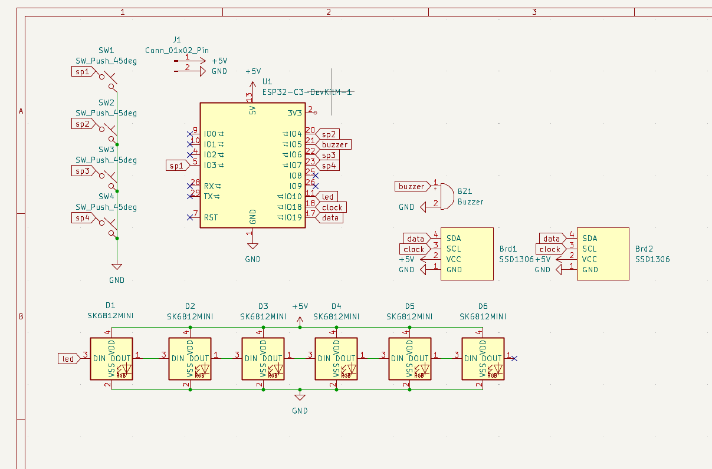
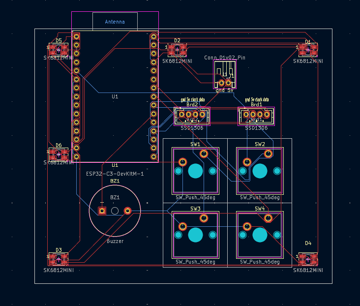
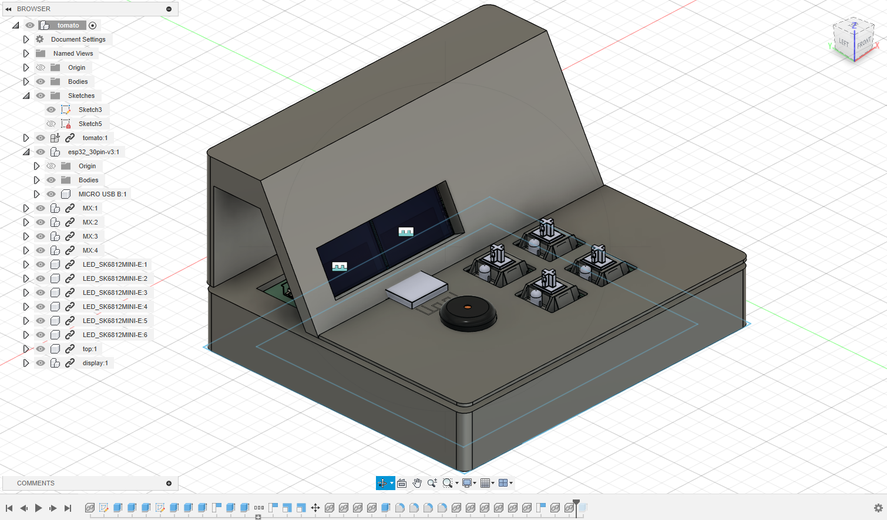

# RGB Pomodoro Timer

This is a pocket Pomodoro timer that displays time, date, and motivational quotes using RGB LEDs, dual OLED screens, and Cherry MX switches, all powered by an ESP32-C3. It’s designed to be compact, functional, and visually engaging.

I made this project because I wanted a fun and personal way to stay focused during work sessions. I’ve always liked the tactile feel of mechanical keys and the glow of addressable LEDs, and this felt like a good way to bring them together into something useful. (Also I have like a bunch of unused stickers and I figured I could use them to decorate the case.)

## images

## Bill of Materials (BOM)

| Item                        | Quantity | Approx. Price | Source |
|-----------------------------|----------|----------------|--------|
| ESP32-C3 DevKitM-1          | 1        | $9.40        | [DigiKey](https://www.digikey.com/en/products/detail/espressif-systems/ESP32-C3-DEVKITM-1U/15198974) |
| SK6812 Mini RGB LEDs (20x minimum)| 6  | $2.34         | [AliExpress](https://www.aliexpress.us/item/3256805007401420.html) |
| Cherry MX Switches          | 4        | $0 (alr have them)  | [AliExpress](https://www.aliexpress.us/item/2255800925392137.html) |
| 0.96" I2C OLED Display      | 2        | $4.64 total   | [AliExpress](https://www.aliexpress.us/item/3256804169233174.html) |
| Passive Buzzer              | 1        | $0 (alr have one) | [AliExpress](https://www.aliexpress.us/item/3256807544525574.html) |
| Battery Holder (AAA or 9V) | 1        | $1.01         | [AliExpress](https://www.aliexpress.us/item/3256805982918007.html) |
| Prototype PCB / Custom PCB | 1        | $26.73 (shipping included)  | JLCPCB |
| Total |0| $44.12 (47.20 w tax) | n/a |

